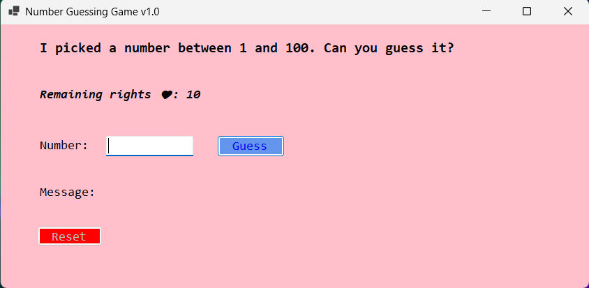

# Number Guessing Game (WinForms) 🎲

A classic "Guess the Number" game built with **C#** and **.NET Windows Forms**. The computer picks a random number between 1 and 100, and the player tries to find it using "Higher/Lower" hints before their lives run out.

## Features

* **Smart Hints:** Tells you to go "Bigger ⬆️" or "Smaller ⬇️" based on your guess.
* **Lives System:** You have 10 hearts (Remaining rights ❤️). Every wrong guess costs a life!
* **Track Your Progress:** Shows your "Latest Number" so you don't forget your last guess.
* **Input Validation:** Prevents crashes if you enter text instead of numbers.
* **Replayability:** "Reset" button allows you to start a new game instantly with a fresh number.

## 🛠Built With

* C#
* .NET Windows Forms (WinForms)
* Visual Studio 2026
* Event-Driven Programming

## How to Play

1.  Enter a number between **1 and 100** in the box.
2.  Press `Enter` or click **Guess**.
3.  Follow the hints (⬆️ or ⬇️).
4.  Find the number before your hearts run out!

## Screenshots

| Winning 🎉 | Losing 💀 |
|:---:|:---:|
| *(Green Background)* | *(Red Hints)* |

---
*Developed by [Umut Albayrak](https://github.com/Umutalb)*